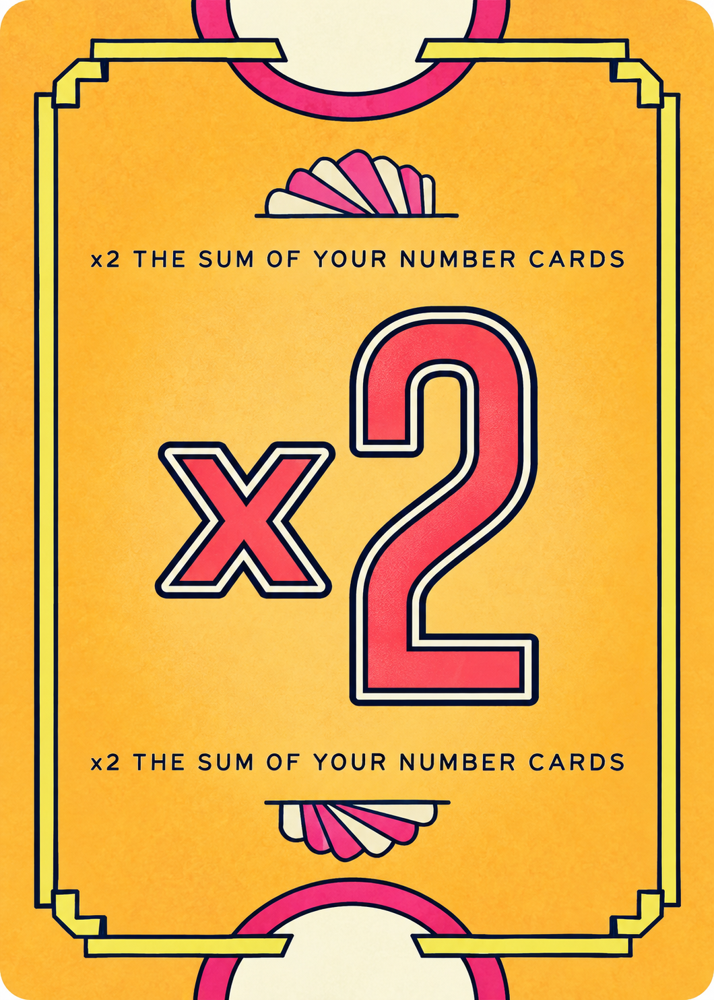
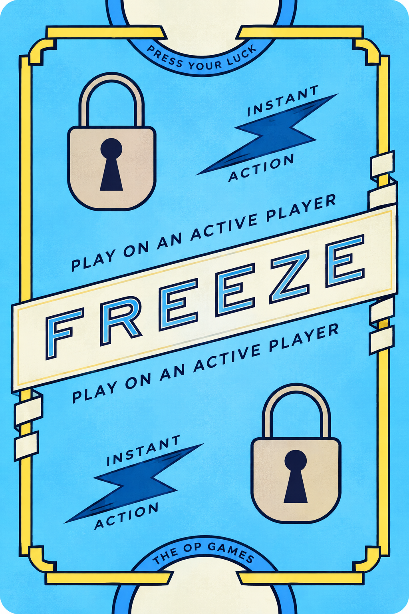

<p align="center">
  
</p>

<h1 align="center">Flip7 Companion</h1>

<p align="center">A real-time companion app for playing <strong>Flip 7</strong> with a physical deck.</p>

<p align="center">
  <a href="#what-it-does">What it does</a> ·
  <a href="#play-a-match">Play a match</a> ·
  <a href="#scoring">Scoring</a> ·
  <a href="#run-locally">Run locally</a> ·
  <a href="#project-structure">Project structure</a>
</p>

---

## What it does

Flip7 Companion keeps a physical Flip 7 table in sync. Players still use the real deck; the app **never deals, draws, or randomizes cards**. When a physical card is revealed, a player records it in the app and the shared table updates for everyone in the room.

The app includes:

- Responsive landing, rules, FAQ, privacy policy, terms, and contact pages.
- Guest-first entry: choose a display name once, then use it across the lobby and rooms.
- Host-created rooms with six-character share codes.
- Join requests and host approval before a match can begin.
- A 3–18 player table rule and configurable target scores from 50–500.
- Live round tracking, card selection, corrections, undo/redo, and card organization.
- Authoritative, server-side score calculation and round settlement through Supabase RPCs.
- Individual round-score history on the match results screen.
- A public local demo mode for practicing card choices and scoring without signing in or saving data.
- A mobile-first layout, installable PWA metadata, and cached app assets for faster repeat loads.
- Branded in-app warning dialogs in place of browser validation bubbles.

> **Version 1 note:** account sign-in and sign-up are intentionally unavailable in the current UI while the app is tested with more players. The Account tab shows a “Coming soon” dialog. Guest sessions and shared rooms are the supported way to play today.

## Card gallery

These are the same card images used in the app from [`public/cards`](public/cards).

<p align="center">
  
  
  
  
  
  
</p>

## What you need at the table

- A physical Flip 7 deck.
- One phone, tablet, or browser for each player, or one shared device to record the table.
- An internet connection for live multi-player rooms backed by Supabase.

The host creates the room, shares its code, approves the players, and starts the match. Every player records the cards in front of them as the physical deck is played.

## Play a match

1. Open **PLAY!** and enter a display name to start as a guest.
2. In the lobby, choose **Host a game** or **Join a game**.
3. The host chooses a target score and creates a room. The room code can be copied from the room screen.
4. Players enter the code and request a seat. The host approves each request.
5. Once 3–18 players are approved, the host starts the match.
6. During a round, record each physical card, choose **Hit** or **Stay / Bank**, and use the card controls to correct a mistake if needed.
7. When every player is banked, frozen, or busted, settle the round and continue. The match ends after a settled round puts at least one player at the target score.

### Player and host roles

| Role | Responsibilities |
| --- | --- |
| Host | Creates the room, shares the code, approves players, starts the match, and proceeds when a round is ready to settle. |
| Player | Requests a seat, records physical cards, chooses when to bank, and sees shared score state in real time. |

The host is marked with a crown in the lobby and game views. If the host becomes stale, the backend includes host-transfer support so a room can keep moving.

## Scoring

### Number cards

Number cards score their face value. A number can only appear once in a player’s active round. Revealing a duplicate Number card causes a bust unless a Second Chance card is available.

The `0` card scores zero but still counts as a unique Number card.

### Modifiers

Modifier cards do not count as Number cards and cannot cause a duplicate bust.

| Card | Effect |
| --- | --- |
| ×2 | Doubles the total of the player’s Number cards. |
| +2, +4, +6, +8, +10 | Adds the printed points after any ×2 calculation. |

### Action cards

| Card | Effect |
| --- | --- |
| Second Chance | Cancels one duplicate Number card. The duplicate and Second Chance are discarded; the rest of the round remains. |
| Freeze | Banks an active player and locks in their round score. |
| Flip Three | Makes an active target accept three cards, one at a time. |

Actions target active players, including the player who recorded the card. A player who has stayed, frozen, or busted is no longer active.

### Score order

The app calculates every round in this order:

1. Add the values of all active Number cards.
2. Apply the ×2 card, if present.
3. Add the points from + modifiers.
4. Add the **+15 Flip 7 bonus** when the player has seven unique Number cards.

For example:

```text
0 + 1 + 6 + 7 + 9 + 10 + 11 + 12 = 56
56 × 2 = 112
112 + 2 = 114
114 + 15 = 129
```

Seven unique Number cards immediately end the round for that player and award the +15 bonus. A player who busts earns zero for the round. At the end of the match, the player with the highest total wins.

## Product pages

| Route | Purpose |
| --- | --- |
| `/landing` | Marketing landing page and entry point. |
| `/rules` | Illustrated game rules, deck reference, actions, and score examples. |
| `/faq` | Answers for rooms, turns, scoring, and corrections. |
| `/privacy` | Data Privacy Policy. |
| `/terms` | Terms & Conditions. |
| `/contact` | Contact page. The built-in contact form is coming soon; the page currently offers an email copy action. |
| `/lobby` | Guest entry and room lobby. |
| `/game/:ROOM_CODE` | Waiting room, active match, round review, and final results for a room. |
| `/demo` | Local solo practice table. Choices stay in memory and are discarded when the demo is left or refreshed. |

## Technology

| Area | Implementation |
| --- | --- |
| UI | React 19, TypeScript, Vite 8 |
| Animation | Motion |
| Icons | Lucide React |
| Data, auth, real-time | Supabase Auth, Postgres, Realtime, and RPC functions |
| Offline shell and asset caching | Web app manifest and service worker |
| Styling | Project CSS with a responsive, mobile-first Carnival Table design |

## Run locally

### Prerequisites

- Node.js 20 or newer.
- npm.
- A Supabase project with the migrations in this repository applied.

### 1. Install dependencies

```bash
npm install
```

### 2. Configure Supabase

Copy the example environment file:

```bash
cp .env.example .env.local
```

Set these values in `.env.local`:

```dotenv
VITE_SUPABASE_URL=https://your-project.supabase.co
VITE_SUPABASE_PUBLISHABLE_KEY=your_publishable_key
```

Apply the SQL migrations in [`supabase/migrations`](supabase/migrations) to the same Supabase project, in filename order. They create the room, membership, round, card, event, realtime, policy, and RPC-function behavior used by the client.

### 3. Start the development server

```bash
npm run dev
```

Vite prints the local address, normally `http://localhost:5173`.

### Production build

```bash
npm run build
npm run preview
```

`npm run build` runs TypeScript validation before generating the production bundle in `dist/`.

## Environment variables

| Variable | Required | Description |
| --- | --- | --- |
| `VITE_SUPABASE_URL` | Yes | URL for the Supabase project that hosts rooms and real-time game state. |
| `VITE_SUPABASE_PUBLISHABLE_KEY` | Yes | Publishable key used by the browser client. |

The application shows a clear configuration screen when these values are missing.

## Project structure

```text
public/
├── assets/                 # Logo, favicon, PWA icons, and promotional art
├── cards/                  # Physical-card artwork used by the game and pages
├── manifest.webmanifest    # Installable PWA metadata
└── sw.js                   # Service worker and static-asset cache

src/
├── components/             # Shared card artwork, room code, and modal components
├── game/                   # Card definitions and card-code mapping
├── lib/                    # Supabase client, room API, app utilities
├── pages/
│   ├── auth/               # Guest entry and account-coming-soon dialog
│   ├── contact/            # Contact page and copy-email action
│   ├── faq/                # FAQ page
│   ├── game/               # Live table, cards, controls, and dialogs
│   ├── home/               # Join and host room lobby
│   ├── landing/            # Marketing page and footer
│   ├── legal/              # Privacy and terms content
│   ├── results/            # Winner board and expandable round history
│   ├── room/               # Waiting room, members, approvals, and start controls
│   └── rules/              # Illustrated rules reference
├── styles/                 # Shared, lobby, and finishing styles
├── App.tsx                 # Route selection and auth/session orchestration
└── main.tsx                # React entry point

supabase/migrations/        # Versioned database schema, policies, and RPC updates
```

## Supabase responsibilities

The browser client requests game changes through Supabase RPC functions. The database is the source of truth for:

- Creating rooms and generating room codes.
- Joining, leaving, approving, and removing room members.
- Starting a match and creating rounds.
- Recording cards, applying targeted actions, and resolving duplicates.
- Undoing or correcting a recorded card.
- Banking, cancelling a bank, busting, freezing, and confirming results.
- Applying the score order and Flip 7 bonus.
- Finalizing rounds, maintaining totals, and recording final results.
- Handling stale-host transfer and real-time table updates.

Row Level Security policies protect room data, while Realtime keeps players’ browsers synchronized.

## PWA and caching

The app includes `public/manifest.webmanifest`, a rounded Flip7 Companion app icon, and `public/sw.js`.

The service worker caches the application shell, logo, card artwork, and other static assets so repeat visits load faster. Live rooms still require a network connection because cards, scores, and player state come from Supabase in real time.

## Design notes

- The interface is optimized for phones first, then expands to larger layouts.
- Card art is used in the game picker and the Rules, FAQ, Privacy, Terms, and Contact hero sections.
- The avatar in the game header is a player-token button that opens the room menu.
- User-facing validation and room errors use the in-app modal style for a consistent experience.
- The results screen keeps the primary total readable and reveals round-by-round scores on demand.

## Current limitations

- Email/password accounts are intentionally hidden behind a “Coming soon” message for version-one testing.
- The contact form itself is not built yet; the Contact page currently provides a copyable email address.
- The app is a companion to the physical game and does not replace the deck or deal cards automatically.

## License and trademarks

Flip7 Companion is an independent, unofficial companion app made for people who want to play the physical card game with friends. It is not affiliated with, endorsed by, sponsored by, or associated with the creator, publisher, or other rights holders of **Flip 7**.

**Flip 7** and its related game materials belong to their respective owners. This app records cards that players physically reveal; it does not provide or replace the physical game. Ensure you have the right to use the included artwork and game references before publishing or distributing a derivative version.
